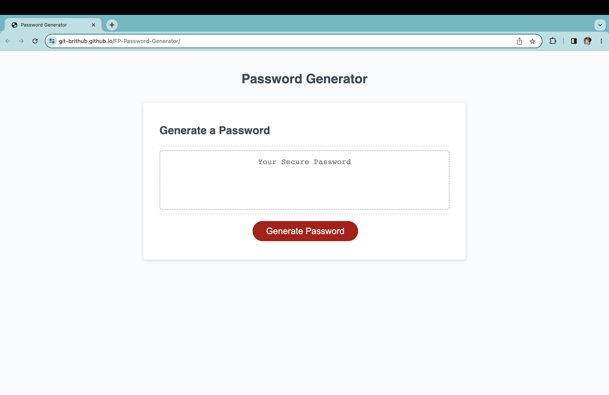

# FP-Password-Generator
Friendly Parakeet's (FP) Secure Password Generator
 

## Links
[GitHub Repo](https://github.com/Git-BritHub/FP-Password-Generator.git)
 
[Live URL](https://git-brithub.github.io/FP-Password-Generator/)

## Description
For employer Friendly Parakeet, I debugged and wrote code that allowed JavaScript to successfully generate a secure, strong and random password. This user-friendly password generator includes prompt questions; which give the employee control of the type and length of characters to have within.

## Usage

## Credits
Sought guidance and feedback from the U of U's software developer tutors
